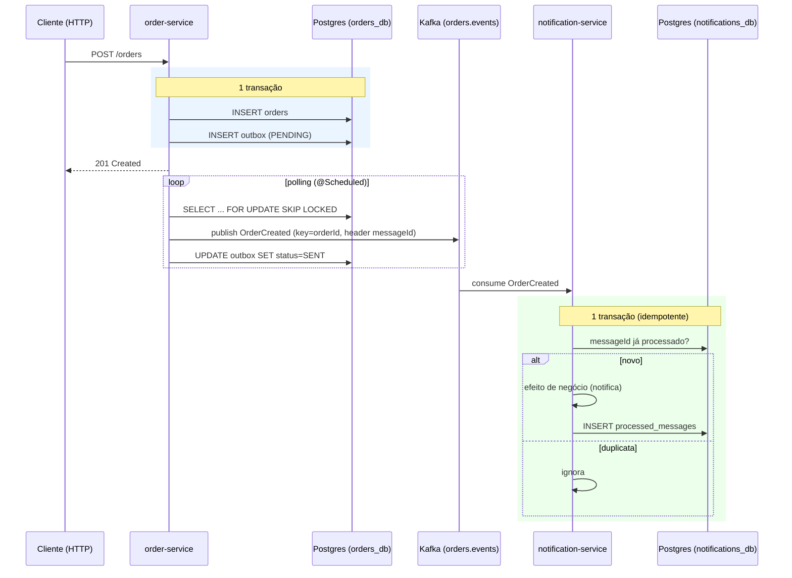

# Inbox / Outbox com Kafka — exemplo didático

Projeto de **estudo** dos padrões **Transactional Outbox** e **Inbox (Idempotent Consumer)** com
**Java + Spring Boot + Apache Kafka + PostgreSQL**.

O objetivo é mostrar, com código pequeno e comentado, **por que** esses padrões existem e **como**
implementá-los de ponta a ponta.

---

## 1. O problema: dual-write

Imagine um serviço que, ao criar um pedido, precisa **(a)** gravar o pedido no banco e
**(b)** publicar um evento `OrderCreated` no Kafka para outros serviços reagirem.

```
   salvar no Postgres   →   publicar no Kafka
```

Não existe transação distribuída entre Postgres e Kafka. Então qualquer uma destas falhas
deixa o sistema **inconsistente**:

- Gravou no banco, mas caiu antes de publicar → outros serviços nunca souberam do pedido.
- Publicou no Kafka, mas a transação do banco deu rollback → evento de um pedido que não existe.

Esse é o **problema do dual-write**. Outbox resolve a produção; Inbox resolve o consumo.

---

## 2. A solução

### Outbox (lado producer — `order-service`)

Em vez de publicar no Kafka dentro da transação, gravamos o evento numa tabela `outbox`
**na mesma transação** que altera o estado de negócio:

```
┌─ TRANSAÇÃO ──────────────────────────────┐
│  INSERT INTO orders (...)                 │
│  INSERT INTO outbox (..., status=PENDING) │
└───────────────────────────────────────────┘
            (commit atômico)
                  │
                  ▼
   Um publisher assíncrono lê a outbox e publica no Kafka.
```

Como as duas escritas estão na mesma transação ACID, é **impossível** ter pedido sem evento
ou evento sem pedido. A publicação no broker vira um passo separado e reprocessável.

### Inbox (lado consumer — `notification-service`)

O Kafka entrega **at-least-once**: a mesma mensagem pode chegar mais de uma vez (rebalance,
republicação do outbox após crash, retry...). Para o efeito de negócio acontecer **uma única vez**,
o consumer registra cada `messageId` processado numa tabela `processed_messages`:

```
┌─ TRANSAÇÃO ───────────────────────────────────────┐
│  já existe messageId em processed_messages?        │
│     sim → ignora (duplicata)                        │
│     não → executa efeito de negócio                 │
│           INSERT INTO processed_messages(messageId) │
└─────────────────────────────────────────────────────┘
```

---

## 3. Fluxo ponta a ponta



---

## 4. Estrutura do projeto

```
inbox-outbox-example/
├── events/                     contrato compartilhado (OrderCreatedEvent, Topics, Headers)
├── order-service/   (OUTBOX)   REST + JPA + tabela outbox + OutboxPublisher (polling)
├── notification-service/ (INBOX) @KafkaListener + tabela processed_messages + retry/DLT
├── docker-compose.yml          Kafka (KRaft) + Postgres (2 DBs) + Kafka UI; profile "cdc": Debezium
├── docker/                     init.sql (cria os DBs) e outbox-connector.json (CDC)
└── loadtest/                   teste de carga Scheduled × CDC: burst.js (k6) + latency.sql
```

Arquivos-chave para ler nesta ordem:

| Conceito | Arquivo |
|---|---|
| Escrita transacional Order+Outbox | `order-service/.../application/OrderService.java` |
| Publicação por polling + SKIP LOCKED | `order-service/.../outbox/OutboxPublisher.java` e `OutboxRepository.java` |
| Consumo idempotente (dedup) | `notification-service/.../inbox/InboxService.java` |
| Retry + Dead Letter Topic | `notification-service/.../config/KafkaConsumerConfig.java` |

---

## 5. Como rodar

> Pré-requisitos: **Docker Desktop em execução**, **JDK 25** e o Gradle wrapper incluso.

### 5.1. Subir a infra

```bash
docker compose up -d
```

Sobe Kafka, Postgres (com `orders_db` e `notifications_db`) e o **Kafka UI** em
<http://localhost:8080> para inspecionar tópicos e mensagens.

### 5.2. Subir as aplicações (dois terminais)

```bash
./gradlew :order-service:bootRun          # http://localhost:8081
./gradlew :notification-service:bootRun   # http://localhost:8082
```

### 5.3. Criar um pedido

```bash
curl -i -X POST http://localhost:8081/orders \
  -H "Content-Type: application/json" \
  -d '{"customer":"Alice","amount":199.90}'
```

Observe:
1. A linha em `outbox` mudando de `PENDING` → `SENT` (`orders_db`).
2. A mensagem no tópico `orders.events` (Kafka UI).
3. O log do `notification-service`: `Notificação enviada: pedido ...`.

### 5.4. Demonstrar a deduplicação (Inbox)

> **Pré-requisito:** a infra (passo 5.1, `docker compose up -d`) e o `notification-service`
> (passo 5.2) precisam estar no ar. O comando publica no container `iox-kafka`; se ele não
> existir (`No such container: iox-kafka`), suba a infra primeiro.

Publique a **mesma mensagem duas vezes** (mesmo header `messageId`) direto no tópico
`orders.events`. O comando abaixo faz exatamente isso — copie e cole no terminal:

```bash
MSG_ID=11111111-1111-1111-1111-111111111111
ORDER_ID=22222222-2222-2222-2222-222222222222
LINE="messageId:$MSG_ID@$ORDER_ID#{\"orderId\":\"$ORDER_ID\",\"customer\":\"Dup\",\"amount\":10.00,\"createdAt\":\"2026-06-27T12:00:00Z\"}"
printf '%s\n%s\n' "$LINE" "$LINE" | MSYS_NO_PATHCONV=1 docker exec -i iox-kafka /opt/kafka/bin/kafka-console-producer.sh \
  --bootstrap-server localhost:9092 --topic orders.events \
  --property parse.headers=true --property headers.delimiter=@ --property headers.key.separator=: \
  --property parse.key=true --property key.separator='#'
```

> O formato de cada linha é `headers@key#value`: o header `messageId` (id de idempotência), a
> chave Kafka (`orderId`) e o payload JSON do evento. As duas linhas são idênticas de propósito.
>
> O prefixo `MSYS_NO_PATHCONV=1` é necessário **só no Git Bash (Windows)**: sem ele, o MSYS
> converte o caminho `/opt/kafka/...` para um caminho Windows e o Docker falha com
> `exec: ".../opt/kafka/bin/kafka-console-producer.sh": no such file or directory`. Em
> Linux/macOS/WSL o prefixo é inofensivo (pode mantê-lo ou removê-lo).

No log do `notification-service`, a 1ª cópia é processada e a 2ª é ignorada como duplicata:

```
c.m.n.application.NotificationService : Notificação enviada: pedido 22222222-... do cliente Dup no valor 10.00
c.m.n.inbox.InboxService             : Inbox: mensagem 11111111-... já processada — ignorando duplicata
```

> Como o `messageId` é fixo no comando, ao rodar de novo **ambas** as cópias aparecem como
> duplicata (o id já está em `processed_messages`) — o que também comprova a idempotência.
> Para um cenário "1 novo + 1 duplicata" a cada execução, troque os UUIDs (ex.: `uuidgen`).

### 5.5. Demonstrar retry + Dead Letter Topic

Crie um pedido cujo nome do cliente contenha `fail` (gatilho de erro proposital):

```bash
curl -X POST http://localhost:8081/orders \
  -H "Content-Type: application/json" \
  -d '{"customer":"fail-customer","amount":10.00}'
```

O consumer tenta processar, falha, faz retry com backoff (1s, 2s, 4s) e, ao esgotar,
publica a mensagem em `orders.events.DLT`. Veja a DLT no Kafka UI.

---

## 6. Testes automatizados

```bash
./gradlew test
```

Usam **Testcontainers** (Postgres real), então **exigem Docker em execução**:

- `OutboxTransactionalIntegrationTest` — garante que `createOrder` grava Order **e** Outbox
  atomicamente (a linha fica `PENDING`).
- `InboxDeduplicationIntegrationTest` — garante que processar o mesmo `messageId` duas vezes
  executa o efeito de negócio **uma única vez**.

---

## 7. Alternativa: publicação via CDC (Debezium)

O publisher por **polling** é simples e auto-contido (recomendado para começar). Em produção,
muitos times preferem **CDC (Change Data Capture)**: o **Debezium** lê o *write-ahead log* do
Postgres e publica as linhas da `outbox` automaticamente — sem job de polling na aplicação.

### Como demonstrar

1. Desligue o polling no `order-service`: em `application.yml`, `outbox.publisher.enabled: false`.
2. Suba a infra com o profile CDC:
   ```bash
   docker compose --profile cdc up -d
   ```
3. Registre o connector:
   ```bash
   curl -X POST http://localhost:8083/connectors \
     -H "Content-Type: application/json" \
     -d @docker/debezium/outbox-connector.json
   ```

O connector usa o **Outbox Event Router** do Debezium, mapeando as colunas deste exemplo
(`message_id`, `aggregate_id`, `event_type`, `payload`) e propagando `messageId`/`eventType` como
headers — então o `notification-service` deduplica exatamente como no modo polling.

> Os nomes/opções de SMT do Debezium podem variar entre versões; ajuste `outbox-connector.json`
> conforme a versão da imagem `quay.io/debezium/connect`.

### Polling vs CDC

| | Polling publisher | CDC (Debezium) |
|---|---|---|
| Infra extra | Nenhuma | Kafka Connect + Debezium |
| Latência | Intervalo do polling | Quase em tempo real |
| Carga no banco | Consultas periódicas | Lê o WAL (baixo overhead) |
| Acoplamento | Lógica de publicação na app | Publicação fora da app |
| Para aprender o padrão | ✅ Mais simples | Mais peças móveis |

---

## 8. Decisões e trade-offs deste exemplo

- **`events` como módulo Java compartilhado** acopla os serviços ao contrato em tempo de
  compilação. É didático, mas em produção prefira um schema versionado (Avro/JSON Schema) +
  Schema Registry.
- **Um Postgres com dois databases** (em vez de dois containers) reduz a infra, mantendo a
  semântica de "um database por serviço".
- **Linhas `SENT` ficam na outbox** para auditoria. Em produção, adicione um job de limpeza
  (ou delete após publicar) para a tabela não crescer indefinidamente.
- **Garantia ponta a ponta é at-least-once.** O `enable.idempotence` do producer evita duplicatas
  de *retry* do próprio Kafka, mas a deduplicação de **negócio** é responsabilidade do Inbox.
- **Ordenação por pedido** é preservada usando `orderId` como chave Kafka (mesma chave → mesma
  partição → ordem garantida dentro do pedido).

---

## 9. Teste de carga: Scheduled × CDC

Cenário **burst (rajada)** para comparar, com números, os dois mecanismos de publicação do Outbox:
o publisher por **polling** (`@Scheduled`) e o **CDC** (Debezium). A ideia é injetar muitos pedidos
de uma vez (enchendo a `outbox`) e medir quanto tempo cada mecanismo leva para **drenar** a rajada e
qual a **latência ponta a ponta** (criação do pedido → evento processado pelo consumer).

### 9.1. Por que medir no consumer (e não no HTTP)

O `POST /orders` é **idêntico** nos dois modos — ele só grava `orders` + `outbox(PENDING)` e retorna
`201`. A publicação é assíncrona e desacoplada, então a latência do HTTP **não** distingue polling de
CDC. O que distingue é o caminho **banco → Kafka → consumer**. Por isso a medição é feita no
`notification-service`: a coluna `processed_messages.event_created_at` (migration `V2`) guarda o
`createdAt` do evento, e a latência sai direto em SQL como `processed_at − event_created_at` — a mesma
métrica vale para os dois modos.

### 9.2. Pré-requisitos

- Infra no ar (passo 5.1) e as duas apps (passo 5.2).
- A carga é gerada com a imagem oficial do **k6** (não precisa instalar nada no host), via Docker.
- Artefatos em `loadtest/`: `burst.js` (script k6) e `latency.sql` (métricas).

### 9.3. Rodar o cenário (para cada modo)

**1) Limpe as tabelas** (slate limpo entre execuções):

```bash
docker exec iox-postgres psql -U app -d orders_db        -c "TRUNCATE outbox, orders;"
docker exec iox-postgres psql -U app -d notifications_db -c "TRUNCATE processed_messages;"
```

**2) Dispare a rajada** (5000 pedidos, 50 workers em paralelo):

```bash
# Linux: use --network host e localhost
docker run --rm --network host \
  -e TARGET=http://localhost:8081 -e TOTAL=5000 -e VUS=50 \
  -v "$PWD/loadtest:/scripts" grafana/k6 run /scripts/burst.js

# Docker Desktop (Windows/Mac): troque o alvo para host.docker.internal
docker run --rm \
  -e TARGET=http://host.docker.internal:8081 -e TOTAL=5000 -e VUS=50 \
  -v "$PWD/loadtest:/scripts" grafana/k6 run /scripts/burst.js
```

**3) Acompanhe a drenagem** (quando `processed` chega a 5000, terminou):

```bash
docker exec iox-postgres psql -U app -d notifications_db \
  -c "SELECT count(*) FROM processed_messages WHERE event_created_at IS NOT NULL;"
```

**4) Colete as métricas:**

```bash
docker exec -i iox-postgres psql -U app -d notifications_db -f - < loadtest/latency.sql
```

Para o modo **polling**, rode com a app padrão (`outbox.publisher.enabled=true`). Para o modo **CDC**,
suba o `order-service` com `--outbox.publisher.enabled=false`, suba o profile `cdc` e registre o
connector (seção 7). No CDC a app **não marca `SENT`** — as linhas ficam `PENDING` na `outbox` (a
publicação acontece fora da app); a medição de drenagem é sempre no consumer.

**Escalando o consumer (partições × concorrência).** A vazão do consumer só cresce se houver
**partições** no tópico **e** threads para consumi-las. Suba o `notification-service` com a
concorrência casada ao número de partições e ajuste o tópico antes (com o consumer parado, pois um
consumer ativo recria o tópico via auto-create):

```bash
# nº de partições (use --alter para aumentar; só cresce)
docker exec iox-kafka /opt/kafka/bin/kafka-topics.sh --bootstrap-server localhost:9092 \
  --alter --topic orders.events --partitions 5

# concorrência do consumer = nº de partições
java -jar notification-service/build/libs/notification-service-0.0.1-SNAPSHOT.jar \
  --app.consumer.concurrency=5
```

**Publisher de alto volume (polling).** Para o publisher acompanhar uma rajada grande, suba o lote e
reduza o intervalo (o `OutboxPublisher` envia o lote em voo e dá `join` único no fim — ver 9.4):

```bash
java -jar order-service/build/libs/order-service-0.0.1-SNAPSHOT.jar \
  --outbox.publisher.batch-size=1000 --outbox.publisher.poll-delay-ms=100
```

### 9.4. Relatório — números obtidos

Medições reais nesta máquina (**6 cores**, ~7,7 GB para o Docker; single-node local, apps no host +
infra em Docker). São **números relativos**, não capacidade absoluta. Rajada de **5000–6000 pedidos**
por execução, injeção HTTP de ~600–840 req/s (k6, 100% `201`).

**(a) O gargalo do publisher e a otimização para lote assíncrono.**
Com a config **default** (`batch-size=100`, `poll-delay-ms=1000`) o polling drena ~**50 msg/s** —
limitado pelo ciclo (lote pequeno + 1 s de espera). Tentar subir só a config esbarrou num teto de
~**120 msg/s**: o gargalo **não era o tamanho do lote**, e sim o `kafkaTemplate.send().join()`
**síncrono por mensagem** (esperava o `ack` uma a uma). Por isso o `OutboxPublisher` foi otimizado
para **enviar o lote inteiro em voo e dar `join` uma vez só no fim** (mantendo a garantia
"marca `SENT` apenas após o `ack`" — junta todos os *futures* antes de commitar). Efeito na vazão
**crua do publisher → Kafka**:

| Publisher | Vazão publisher→Kafka |
|---|---:|
| Default (`batch 100` / `delay 1000`) | ~50 msg/s |
| Tunado **síncrono** (`batch 1000` / `delay 100`) | ~120 msg/s (teto do `.join()` serial) |
| Tunado **assíncrono** (lote, `join` no fim) | ~**380–560 msg/s** |

Com o publisher assíncrono (~380–560 msg/s) o gargalo **deixa de ser a publicação** e passa para o
consumer/CPU — então o polling vira **consumer-bound**, igual ao CDC.

**(b) Varredura de partições** (publisher assíncrono `batch 1000`/`delay 100`; consumer com
`concurrency` = nº de partições; medição **ponta a ponta** `created → processed`):

| Partições / `concurrency` | Scheduled async — throughput | Scheduled — p50 | CDC — throughput | CDC — p50 |
|---:|---:|---:|---:|---:|
| 1 | 171 msg/s | 15,4 s | 207 msg/s | 13,0 s |
| 2 | 181 msg/s | 15,4 s | 216 msg/s | 12,6 s |
| 5 | 209 msg/s | 13,0 s | 186 msg/s | 14,4 s |
| 10 | **244 msg/s** | 5,5 s | 212 msg/s | 12,9 s |

### 9.5. Mapa de limites — e por que 1000 msg/s não sai daqui

**Scheduled (publisher assíncrono) — agora consumer-bound, escala fraco com threads.**
Com a publicação destravada (~380–560 msg/s), o end-to-end passa a depender do consumer: sobe de
**171 → 244 msg/s** (~**1,4×**) de 1 para 10 threads/partições. O ganho é **sublinear** porque os
6 cores são disputados por Kafka + Postgres + as duas apps. Resumo da evolução do polling:
default ~50 → tunado síncrono ~120 → **assíncrono ~170–244** msg/s.

**CDC (Debezium) — ~flat em ~205 msg/s.**
Fica em **186–216 msg/s** para 1, 2, 5 ou 10 partições (a variação é ruído). Adicionar threads no
consumer **não ajuda** — mas, ao contrário do que parece, o gargalo **não é a publicação do
Debezium**: medido isolado (consumer parado) ele captura ~**535 msg/s** (ver 9.6). O teto de ~205/s é
**contenção de CPU** quando captura + consumo + Kafka + Postgres dividem os 6 cores.

**Resposta direta: dá pra chegar a 1000 msg/s ponta a ponta aumentando o número de threads?**
**Não nesta máquina.** As duas implementações saturam em ~**200–240 msg/s** e mais threads rendem só
~1,4× (consumer) antes de a CPU dos 6 cores virar o teto. Para ~1000 msg/s o caminho **não é mais
threads no mesmo host**, e sim **escalar horizontalmente**: tópico particionado + **N instâncias** do
`notification-service` (consumer) — e, no polling, **N instâncias** do publisher (o
`FOR UPDATE SKIP LOCKED` paraleliza com segurança) — distribuídas em **mais cores/máquinas**. O
experimento mostra onde cada uma satura: o polling **deixou de saturar na publicação** (após o lote
assíncrono) e ambos passam a saturar no **consumo/CPU**.

> Reproduza variando `-e TOTAL=`/`-e VUS=` no k6, `--outbox.publisher.batch-size`/`--…poll-delay-ms`
> (publisher) e partições/`--app.consumer.concurrency` (consumer) para ver os limites se moverem.

### 9.6. Dá para escalar o Debezium para capturar mais?

Um conector Debezium para Postgres roda como **uma única task** (o `tasks.max` é ignorado: o slot de
replicação lógica é consumido serialmente). Não dá para paralelizar a captura de um mesmo slot/tabela.
Resta **tunar a task única** e **dar mais recursos** — foi o que medimos.

Tuning aplicado (em `loadtest/outbox-connector-tuned.json`): `max.batch.size=8192`,
`max.queue.size=32768`, `poll.interval.ms=100`, e producer overrides `compression.type=lz4`,
`linger.ms=20`, `batch.size=131072`. (Heap do `connect` já era `-Xmx2G`, não estava heap-bound.)

**Vazão de captura isolada** (consumer parado, só Debezium → Kafka):

| Conector | Captura (publish→Kafka) |
|---|---:|
| Baseline (sem tuning) | ~**545 msg/s** |
| Tunado (batching + producer overrides) | ~526 msg/s |

**End-to-end** com o conector tunado: **206 / 206 / 206 / 186 msg/s** para 1 / 2 / 5 / 10 partições —
**idêntico** ao baseline (seção 9.4).

**Conclusões:**
- A task única captura ~**535 msg/s** isolada — **~2,6× o end-to-end** (~205/s). Logo, o gargalo
  end-to-end **não é a publicação do Debezium**, é a **CPU** disputada por captura + consumo + Kafka +
  Postgres nos 6 cores.
- **O tuning do conector não moveu nada** (captura ~535 e end-to-end ~205 iguais): a captura é limitada
  pelo **trabalho por evento** (decodificar o WAL + SMT EventRouter), não pela eficiência do producer;
  o heap já era 2 GB; os cores são fixos.
- Para o Debezium "processar mais" de verdade os únicos caminhos são: **(a)** mais cores/máquinas
  (separar `connect`, consumer e infra), ou **(b)** **shardar a fonte** — `outbox` particionada no
  Postgres com **um conector por partição** (cada um com seu slot), o que multiplica a captura ao custo
  de **perder a ordem global** e mais complexidade.

---

## 10. Stack

Java 25 · Spring Boot 4.1 · Spring for Apache Kafka 4.1 · Spring Data JPA · Flyway ·
PostgreSQL 16 · Apache Kafka (KRaft) · Testcontainers 2 · Gradle (Kotlin DSL) · k6 (teste de carga).
