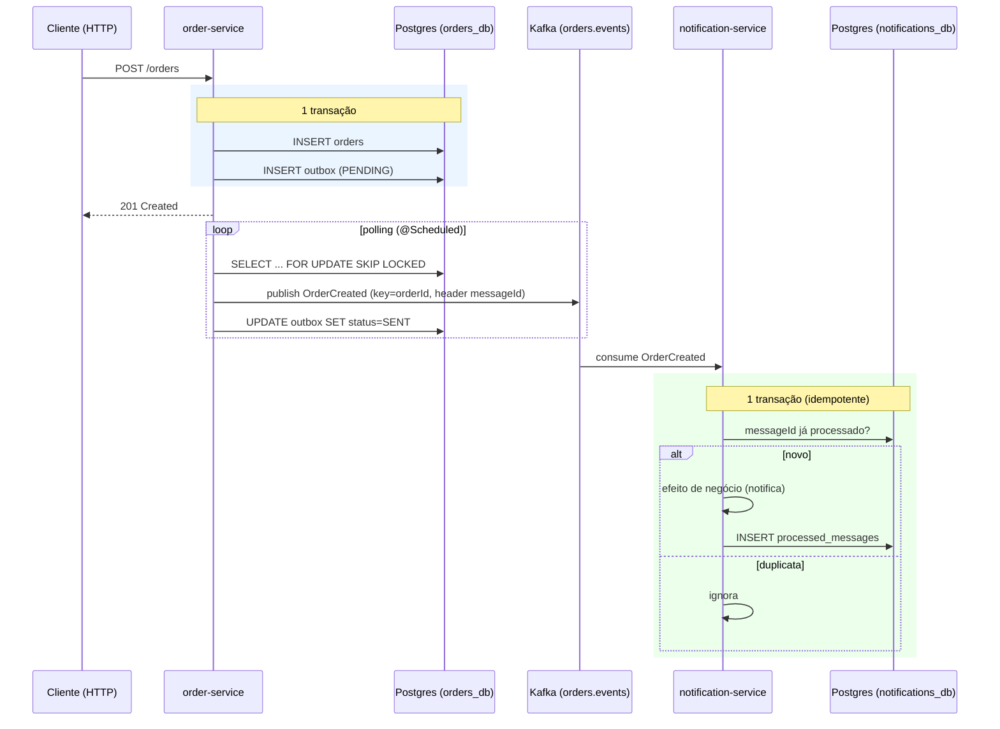

# Inbox / Outbox com Kafka — exemplo didático

Projeto de **estudo** dos padrões **Transactional Outbox** e **Inbox (Idempotent Consumer)** com
**Java + Spring Boot + Apache Kafka + PostgreSQL**.

O objetivo é mostrar, com código pequeno e comentado, **por que** esses padrões existem e **como**
implementá-los de ponta a ponta.

---

## 1. O problema: dual-write

Imagine um serviço que, ao criar um pedido, precisa **(a)** gravar o pedido no banco e
**(b)** publicar um evento `OrderCreated` no Kafka para outros serviços reagirem.

```
   salvar no Postgres   →   publicar no Kafka
```

Não existe transação distribuída entre Postgres e Kafka. Então qualquer uma destas falhas
deixa o sistema **inconsistente**:

- Gravou no banco, mas caiu antes de publicar → outros serviços nunca souberam do pedido.
- Publicou no Kafka, mas a transação do banco deu rollback → evento de um pedido que não existe.

Esse é o **problema do dual-write**. Outbox resolve a produção; Inbox resolve o consumo.

---

## 2. A solução

### Outbox (lado producer — `order-service`)

Em vez de publicar no Kafka dentro da transação, gravamos o evento numa tabela `outbox`
**na mesma transação** que altera o estado de negócio:

```
┌─ TRANSAÇÃO ──────────────────────────────┐
│  INSERT INTO orders (...)                 │
│  INSERT INTO outbox (..., status=PENDING) │
└───────────────────────────────────────────┘
            (commit atômico)
                  │
                  ▼
   Um publisher assíncrono lê a outbox e publica no Kafka.
```

Como as duas escritas estão na mesma transação ACID, é **impossível** ter pedido sem evento
ou evento sem pedido. A publicação no broker vira um passo separado e reprocessável.

### Inbox (lado consumer — `notification-service`)

O Kafka entrega **at-least-once**: a mesma mensagem pode chegar mais de uma vez (rebalance,
republicação do outbox após crash, retry...). Para o efeito de negócio acontecer **uma única vez**,
o consumer registra cada `messageId` processado numa tabela `processed_messages`:

```
┌─ TRANSAÇÃO ───────────────────────────────────────┐
│  já existe messageId em processed_messages?        │
│     sim → ignora (duplicata)                        │
│     não → executa efeito de negócio                 │
│           INSERT INTO processed_messages(messageId) │
└─────────────────────────────────────────────────────┘
```

---

## 3. Fluxo ponta a ponta



---

## 4. Estrutura do projeto

```
inbox-outbox-example/
├── events/                     contrato compartilhado (OrderCreatedEvent, Topics, Headers)
├── order-service/   (OUTBOX)   REST + JPA + tabela outbox + OutboxPublisher (polling)
├── notification-service/ (INBOX) @KafkaListener + tabela processed_messages + retry/DLT
├── docker-compose.yml          Kafka (KRaft) + Postgres (2 DBs) + Kafka UI; profile "cdc": Debezium
└── docker/                     init.sql (cria os DBs) e outbox-connector.json (CDC)
```

Arquivos-chave para ler nesta ordem:

| Conceito | Arquivo |
|---|---|
| Escrita transacional Order+Outbox | `order-service/.../application/OrderService.java` |
| Publicação por polling + SKIP LOCKED | `order-service/.../outbox/OutboxPublisher.java` e `OutboxRepository.java` |
| Consumo idempotente (dedup) | `notification-service/.../inbox/InboxService.java` |
| Retry + Dead Letter Topic | `notification-service/.../config/KafkaConsumerConfig.java` |

---

## 5. Como rodar

> Pré-requisitos: **Docker Desktop em execução**, **JDK 25** e o Gradle wrapper incluso.

### 5.1. Subir a infra

```bash
docker compose up -d
```

Sobe Kafka, Postgres (com `orders_db` e `notifications_db`) e o **Kafka UI** em
<http://localhost:8080> para inspecionar tópicos e mensagens.

### 5.2. Subir as aplicações (dois terminais)

```bash
./gradlew :order-service:bootRun          # http://localhost:8081
./gradlew :notification-service:bootRun   # http://localhost:8082
```

### 5.3. Criar um pedido

```bash
curl -i -X POST http://localhost:8081/orders \
  -H "Content-Type: application/json" \
  -d '{"customer":"Alice","amount":199.90}'
```

Observe:
1. A linha em `outbox` mudando de `PENDING` → `SENT` (`orders_db`).
2. A mensagem no tópico `orders.events` (Kafka UI).
3. O log do `notification-service`: `Notificação enviada: pedido ...`.

### 5.4. Demonstrar a deduplicação (Inbox)

> **Pré-requisito:** a infra (passo 5.1, `docker compose up -d`) e o `notification-service`
> (passo 5.2) precisam estar no ar. O comando publica no container `iox-kafka`; se ele não
> existir (`No such container: iox-kafka`), suba a infra primeiro.

Publique a **mesma mensagem duas vezes** (mesmo header `messageId`) direto no tópico
`orders.events`. O comando abaixo faz exatamente isso — copie e cole no terminal:

```bash
MSG_ID=11111111-1111-1111-1111-111111111111
ORDER_ID=22222222-2222-2222-2222-222222222222
LINE="messageId:$MSG_ID@$ORDER_ID#{\"orderId\":\"$ORDER_ID\",\"customer\":\"Dup\",\"amount\":10.00,\"createdAt\":\"2026-06-27T12:00:00Z\"}"
printf '%s\n%s\n' "$LINE" "$LINE" | MSYS_NO_PATHCONV=1 docker exec -i iox-kafka /opt/kafka/bin/kafka-console-producer.sh \
  --bootstrap-server localhost:9092 --topic orders.events \
  --property parse.headers=true --property headers.delimiter=@ --property headers.key.separator=: \
  --property parse.key=true --property key.separator='#'
```

> O formato de cada linha é `headers@key#value`: o header `messageId` (id de idempotência), a
> chave Kafka (`orderId`) e o payload JSON do evento. As duas linhas são idênticas de propósito.
>
> O prefixo `MSYS_NO_PATHCONV=1` é necessário **só no Git Bash (Windows)**: sem ele, o MSYS
> converte o caminho `/opt/kafka/...` para um caminho Windows e o Docker falha com
> `exec: ".../opt/kafka/bin/kafka-console-producer.sh": no such file or directory`. Em
> Linux/macOS/WSL o prefixo é inofensivo (pode mantê-lo ou removê-lo).

No log do `notification-service`, a 1ª cópia é processada e a 2ª é ignorada como duplicata:

```
c.m.n.application.NotificationService : Notificação enviada: pedido 22222222-... do cliente Dup no valor 10.00
c.m.n.inbox.InboxService             : Inbox: mensagem 11111111-... já processada — ignorando duplicata
```

> Como o `messageId` é fixo no comando, ao rodar de novo **ambas** as cópias aparecem como
> duplicata (o id já está em `processed_messages`) — o que também comprova a idempotência.
> Para um cenário "1 novo + 1 duplicata" a cada execução, troque os UUIDs (ex.: `uuidgen`).

### 5.5. Demonstrar retry + Dead Letter Topic

Crie um pedido cujo nome do cliente contenha `fail` (gatilho de erro proposital):

```bash
curl -X POST http://localhost:8081/orders \
  -H "Content-Type: application/json" \
  -d '{"customer":"fail-customer","amount":10.00}'
```

O consumer tenta processar, falha, faz retry com backoff (1s, 2s, 4s) e, ao esgotar,
publica a mensagem em `orders.events.DLT`. Veja a DLT no Kafka UI.

---

## 6. Testes automatizados

```bash
./gradlew test
```

Usam **Testcontainers** (Postgres real), então **exigem Docker em execução**:

- `OutboxTransactionalIntegrationTest` — garante que `createOrder` grava Order **e** Outbox
  atomicamente (a linha fica `PENDING`).
- `InboxDeduplicationIntegrationTest` — garante que processar o mesmo `messageId` duas vezes
  executa o efeito de negócio **uma única vez**.

---

## 7. Alternativa: publicação via CDC (Debezium)

O publisher por **polling** é simples e auto-contido (recomendado para começar). Em produção,
muitos times preferem **CDC (Change Data Capture)**: o **Debezium** lê o *write-ahead log* do
Postgres e publica as linhas da `outbox` automaticamente — sem job de polling na aplicação.

### Como demonstrar

1. Desligue o polling no `order-service`: em `application.yml`, `outbox.publisher.enabled: false`.
2. Suba a infra com o profile CDC:
   ```bash
   docker compose --profile cdc up -d
   ```
3. Registre o connector:
   ```bash
   curl -X POST http://localhost:8083/connectors \
     -H "Content-Type: application/json" \
     -d @docker/debezium/outbox-connector.json
   ```

O connector usa o **Outbox Event Router** do Debezium, mapeando as colunas deste exemplo
(`message_id`, `aggregate_id`, `event_type`, `payload`) e propagando `messageId`/`eventType` como
headers — então o `notification-service` deduplica exatamente como no modo polling.

> Os nomes/opções de SMT do Debezium podem variar entre versões; ajuste `outbox-connector.json`
> conforme a versão da imagem `quay.io/debezium/connect`.

### Polling vs CDC

| | Polling publisher | CDC (Debezium) |
|---|---|---|
| Infra extra | Nenhuma | Kafka Connect + Debezium |
| Latência | Intervalo do polling | Quase em tempo real |
| Carga no banco | Consultas periódicas | Lê o WAL (baixo overhead) |
| Acoplamento | Lógica de publicação na app | Publicação fora da app |
| Para aprender o padrão | ✅ Mais simples | Mais peças móveis |

---

## 8. Decisões e trade-offs deste exemplo

- **`events` como módulo Java compartilhado** acopla os serviços ao contrato em tempo de
  compilação. É didático, mas em produção prefira um schema versionado (Avro/JSON Schema) +
  Schema Registry.
- **Um Postgres com dois databases** (em vez de dois containers) reduz a infra, mantendo a
  semântica de "um database por serviço".
- **Linhas `SENT` ficam na outbox** para auditoria. Em produção, adicione um job de limpeza
  (ou delete após publicar) para a tabela não crescer indefinidamente.
- **Garantia ponta a ponta é at-least-once.** O `enable.idempotence` do producer evita duplicatas
  de *retry* do próprio Kafka, mas a deduplicação de **negócio** é responsabilidade do Inbox.
- **Ordenação por pedido** é preservada usando `orderId` como chave Kafka (mesma chave → mesma
  partição → ordem garantida dentro do pedido).

---

## 9. Stack

Java 25 · Spring Boot 4.1 · Spring for Apache Kafka 4.1 · Spring Data JPA · Flyway ·
PostgreSQL 16 · Apache Kafka (KRaft) · Testcontainers 2 · Gradle (Kotlin DSL).
